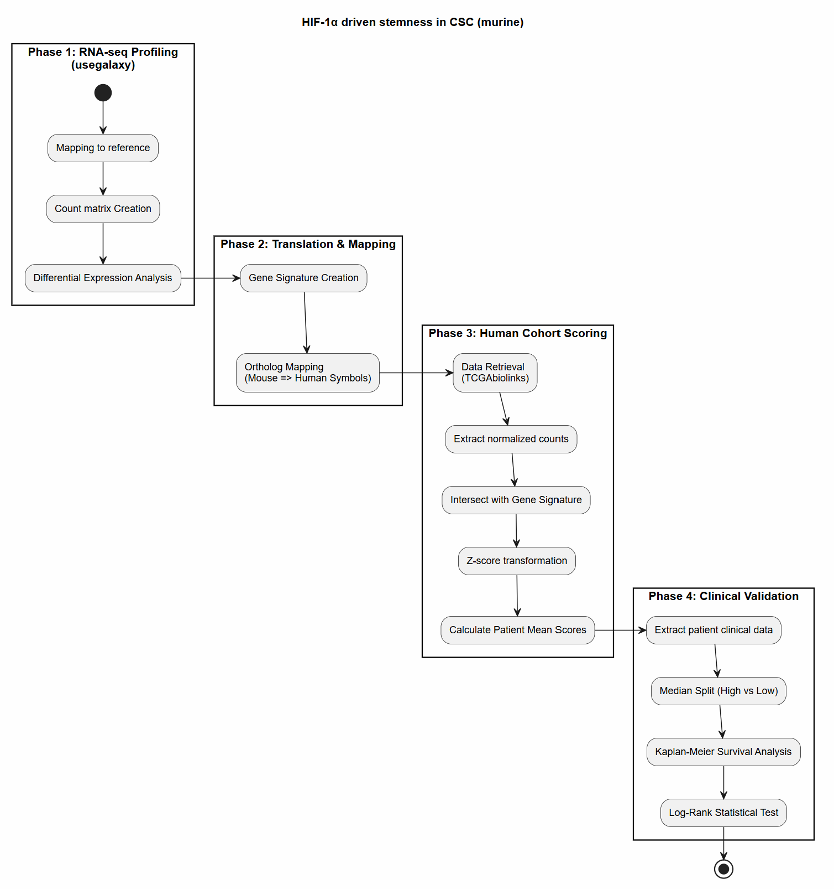
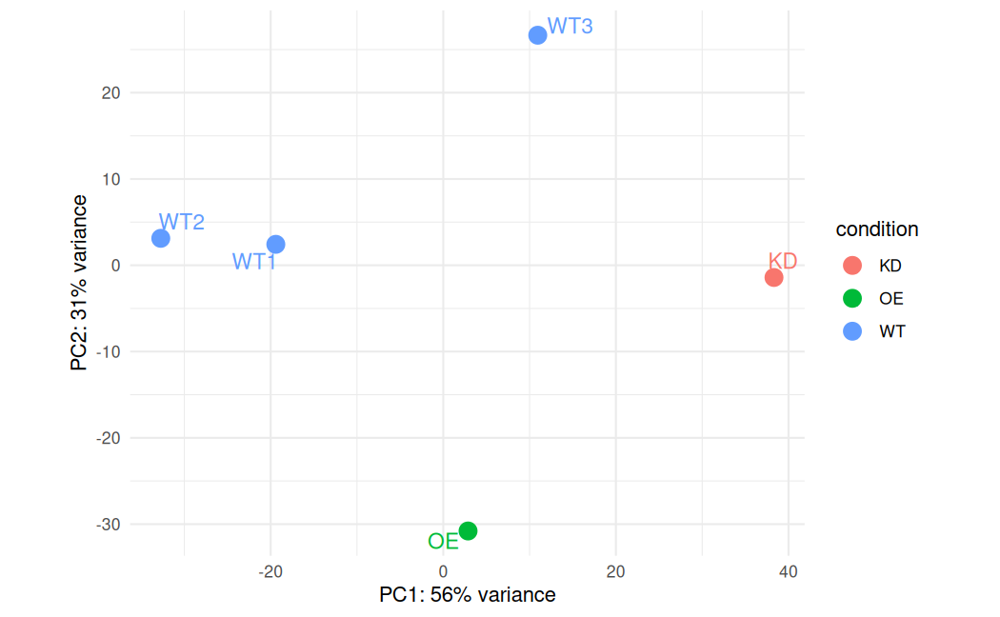
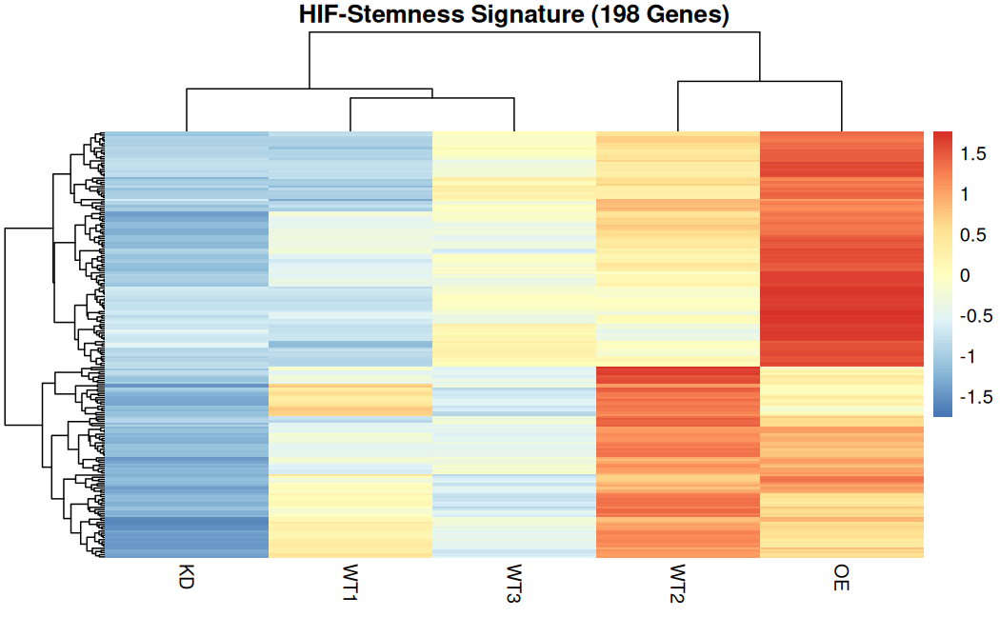
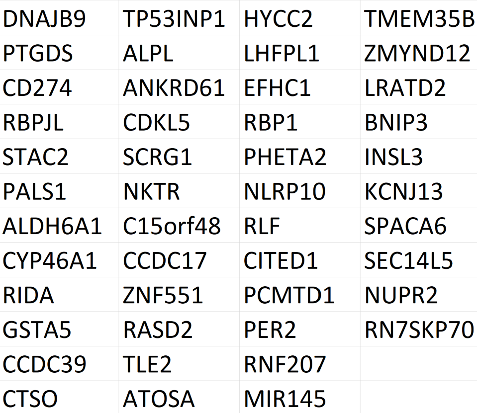
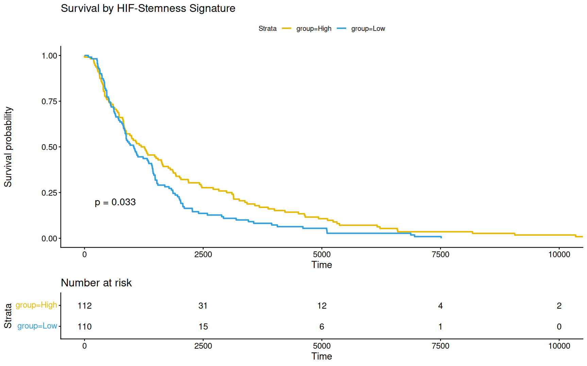

# HIF-1-driven-stemness-in-CSC-murine
HIF-1α-Driven Stemness Maintenance in Cancer Stem Cells (PRJNA1442098) 

Keywords:
Hypoxic response, Stemness response, HIF-1α-Driven Stemness, CSC, TCGA, Survivability studies

I started this project to learn more about the use of marker-based enrichment strategy (like FACS for CD133+ vs CD133- pools) for building a high-sensitivity baseline of stemness transcription factors. 
Complete project was planned in several phases 
> (1) Upstream processing -> setting up the DEseq2 pipeline to obtain signatures specific to this process 
> (2) Downstream processing -> discover the best ways to deconvolve public TCGA data using signatures 
 
Data used for the analysis was taken from [1]. In this project, there were five libraries:
 - HIF-1α overexpression (OE)
 - shControl (WT)
 - HIF-1α knockdown (KD)
 - dynamic suspension culture (WT)
 - conventional three-dimensional culture (WT).

# 1. Complete processing WF

Complete processing WF is shown on Figure 1.

**Figure 1: Complete processing WF**

# 2. Phase I - RNA-seq profiling

Data used in this study is RNA-seq, so appropriate WF was created. The processing steps were as follows (see Figure 1):
 - Quality control (FastQC/MultiQC)
 - Adapter trimming (fastp)
 - Mapping to reference (STAR)
 - Creation of count matrices (featureCount)
 - Differential expression analysis (DESeq2).

Based on libraries obtained in this project, following samples were used in the DESeq2 analysis: 
 - WT cell populations (created using different methods)
 - OE cell populations
 - KD cell populations.

DESeq2 analysis performed was successful despite limited number of replicate, which is sometimes common (e.g. when using public data or difficult enrichment protocols).

**Explanation** 
Because the DESeq2 was setup with 3 WT samples, their variance was used to estimate a global dispersion. 
This allowed the model to function, although the p-value assignments for the KD and OE groups were not accurate. 

After performing Variance stabilizing Transformation (VST) to account for heteroskedastic nature of RNA-seq data, the PCA plot revealed that the WT cell populations, that were created using different methods, are pulling away from each other and KD/OE cell cultures (see Figure 2): 

**Figure 2: PCA plot**

Because of that situation, it was important to identify which WT cell type is which in the plot. This was made using enhanced PCA plot (Figure 3).

**Figure 3: PCA plot - enhanced w/Metadata**

In this study, there are following WT samples: 
 - WT1 = conventional three-dimensional culture (SRR37746879) 
 - WT2 = dynamic suspension culture (SRR37746878) 
 - WT3 = shControl (SRR37746876). 
 

## Breakdown of PCA with Metadata

Following conclussions can be made based on this PCA plot:  
 - WT1 (3D Static suspension) & WT2 (3D Dynamic suspension) --> Transition from static to dynamic suspension had a smaller impact on the transcriptome than the viral transduction/selection process
 - WT3 (shControl) --> WT3 subjected to viral transduction/selection process
 - KD & OE --> These are shifted along PC1 relative to the "shControl" baseline.

*Conclussion* 
Gene expression on KD cell culture should not be compared directly to WT1 or WT2, "shControl" (WT3) is the only valid baseline for the HIF-1α manipulation, as it accounts for the stress of transduction. 

This setup also implies that we are in fact dealing with two independent experiments:  
 > Experiment A --> How does physical stress in the tumor microenvironment (Dynamic Culture) affect the stemness (HIF-1α expression) compared to a standard static 3D culture (WT1, WT2) 
 > Experiment B --> How does changing the HIF-1α expression (upregulation OE using plasmids/viral vectors vs. KD using shRNA) affect the stemmness (OE vs KD vs WT3). 
 
*Conclusion* 
A standard DESeq2 workflow that calculates dispersion can not be used due to the lack of replicates. 
This means that the focus of analysis should move from Statistical Discovery to Pattern Matching with the final aim of building set of genes for finding a signature in the TCGA. 
 
## Calculating the fold change
 
Instead of looking for statistically significant differentially expressed genes, we should be looking for **consistently ranked** genes. The approach taken is: 
>  1.  Normalize the count matrix to TPM --> This accounts for gene length and sequencing depth 
>  2.  Calculate the delta (FC) --> Find genes where the "dosage" of HIF-1α perfectly matches the expression: KD < WT3 < OE. 
>  3.  The Intersection Filter: 
  >  -   Find the top variable genes for HIF-1α stemmness factor (OE vs KD vs WT3)
  >  -   Find the top variable genes related with Physical Stress (WT2 vs WT1)

The intersection of these two lists is **HIF Stemness Signature** 

Based on these findings, it is possible to use the standard way to validate experimental signatures on patient survival using the following steps: 
 - Compute a signature from experimental data (HIF Stemness Signature) 
 - Map mouse genes to human orthologs, annotate (Biomart) 
 - Test that signature in TCGA patient cohorts (TCGA-SKCM) 
 - Build a signature score per TCGA sample by applying Signature gene set to a client TCGA expression matrix (compute z-score as mean(log2(TPM+1)) 
 - Match TCGA expression samples to clinical data 
 - Run Kaplan–Meier / Cox using the TCGA samples grouped by your signature (High vs Low) or using the signature score as continuous predictor. 
 
These procedures are described in the following sections. 
 
Heatmap of stemmness signature (see Figure 3) provides visualization of the signature strength and shows the consistency of expressed genes across the 5 samples. 

**Figure 3: Heatmap of HiF stemness signature (murine)**

## 2. Phase II - Translation and mapping

For Gene signature obtained in the previous step (Phase I) to be used in subsequent phases of analysis, the genes need to be first translated using human --> mouse ortholog mapping and annotated.  
The identified Gene expression profile in a murine model leads to HIF-1α activation. In an independent human melanoma cohort (TCGA-SKCM), this signature could function as statistically significant prognostic marker.  
The prognostic signature obtained in this way can then be used to test survivability.  

After conversion, some of the genes are lost due to the fact that they are missing human orthologs.  
The table of significant markers for HIF-1α signature are shown in the Table 1.  

**Table 1: Significant markers - human orthologs**

Final list contains some genes that are relevant for this process (e.g. BNIP3, CD274 (PD-L1), DNAJB6, TP53INP1 etc.). 
This proves that the assay was able to capture HIF-1α related signaling, even in the absence of biological replicates and statistically significant genes. 

## 3. Phase III - Human cohort scoring

For testing the gene signature agains TCGA database, the TCGA-SKCM (Skin Cutaneous Melanoma cohort) was used.  
The data from *tpm-unstrand* assay was used to calculate the z-score for each gene in signature across all patients. 

## 4. Phase IV - Clinical validation

In order to perform survival analysis, the scores obtained were attached to clinical data and fitted to survival model.  
To perform survival plot, median split on all samples was used.  

The survival plot is shown on the Figure 4.

**Figure 4: Survival plot**

**Conclussion**
Mouse-derived gene signature was succesfuly evaluated against a large human cohort. 
Statistical Significance (p = 0.033) obtained in the Kaplan-Meier plot is below the standard 0.05 threshold. 

*Clinical Relevance* 
The "High Signature" (Yellow) group consistently maintains a higher survival probability than the "Low Signature" (Blue) group over the entire study period. 
This suggests that this HIF-1α signature, obtained using a murine-derived physiology, defines a less-aggressive phenotypic subgroup in human melanoma. 

References:
  [1] Dynamic Suspension Culture System Reveals HIF-1α-Driven Stemness Maintenance via Dual Suppression of the p53 Pathway in Cancer Stem Cells (house mouse), NCBI PRJNA1442098 
