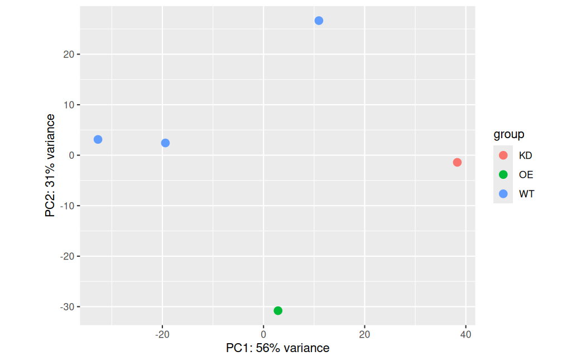

# HIF-1-driven-stemness-in-CSC-murine
HIF-1α-Driven Stemness Maintenance in Cancer Stem Cells (PRJNA1442098) 

Keywords:
HIF-1α-Driven Stemness, CSC, 

I started this project to learn more about the use of marker-based enrichment strategy (like FACS for CD133+ vs CD133- pools) for building a high-sensitivity baseline of stemness transcription factors. 
Complete project was planned in several phases
 (1) Upstream processing -> setting up the DESeq2 pipeline to obtain signatures specific to this process
 (2) Downstream processing -> discover the best ways to deconvolve public TCGA data using signatures

Data used for the analysis was taken from [1]. In this project, there were five libraries:
 - HIF-1α overexpression (OE)
 - shControl (WT)
 - HIF-1α knockdown (KD)
 - dynamic suspension culture (WT)
 - conventional three-dimensional culture (WT).

# 1. Complete processing WF

Complete processing WF is shown on Figure 1.

**Figure 1: Complete processing WF**

# 2. Phase I - RNA-seq profiling

Data used in this study is RNA-seq, so appropriate WF was created. The processing steps were as follows (see Figure 1):
 - Quality control (FastQC/MultiQC)
 - Adapter trimming (fastp)
 - Mapping to reference (STAR)
 - Creation of count matrices (featureCOunt)
 - Differential expression analysis (DESeq2).

Based on libraries obtained in this project, following samples were used in the DESeq2 analysis:
 - WT cell populations created different methods
 - OE cell populations
 - KD cell populations.

DESeq2 analysis performed was successful despite limited number of replicate, which is sometimes common (e.g. when using public data or difficult enrichment protocols).

**Explanation**
Because the DESeq2 was setup with 3 **WT** samples, their variance was used to estimate a "global" dispersion.
This allowed the model to function, though it was likely very conservative with p-value assignments for the **KD** and **OE** groups

After performing Variance stabilizing Transformation (VST) to account for heteroskedastic nature of RNA-seq data, the PCA plot revealed that the WT cell populations, that were created using different methods, are pulling away from each other and KD/OE cell cultures (see Figure 2):

**Figure 2: PCA plot**

Because of that situation, it was important to discover which WT cell type is which in the plot. This was made using enhanced PCA plot (Figure 3).

**Figure 3: PCA plot - enhanced w/Metadata**

In this study, there are following WT samples:
 - WT1 = conventional three-dimensional culture (SRR37746879)
 - WT2 = dynamic suspension culture (SRR37746878)
 - WT3 = shControl (SRR37746876).

### Breakdown of PCA with Metadata

Following conclussions can be made based on this PCA plot:  
**WT1 (3D Static) & WT2 (3D Dynamic)** --> These cell cultures are clustered together on the left, which suggests that the transition from static 3D to dynamic suspension (in this specific dataset) had a much smaller impact on the transcriptome than the viral transduction/selection process.
**WT3 (shControl)** --> WT3 is "Wild Type" in the sense that it isn't knocked down, but it likely went through the **shRNA delivery process** (likely lentivirus/lipofection and selection). Here it is shifted drastically on **PC2**.
**KD & OE** --> These are shifted along **PC1** relative to the "shControl" baseline
Gene expression on **KD** cell culture should not be compared directly to **WT1 or WT2**, "shControl" (WT3) is the only valid baseline for the HIF-1α manipulation, as it accounts for the stress of transduction.

This setup also implies that we are in fact dealing with two independent experiments: 
**Experiment A** --> How does physical stress in the tumor microenvironment (Dynamic Culture) affect the stemness (HIF-1α expression) compared to a standard static 3D culture (WT1, WT2)
**Experiment B** --> How does changing the HIF-1α expression (upregulation OE using plasmids/viral vectors vs. KD using shRNA) affect the stemmness (OE vs KD vs WT3).

**Conclusion**
A standard DESeq2 workflow that calculates **dispersion** (the "noise" level of a gene) can not be used due to the lack of replicates.
This means that the focus of analysis should move from "Statistical Discovery" to "Pattern Matching" with the final aim of building set of genes for finding a signature in the TCGA.

## Calculating the fold change

Instead of looking for statistically significantly different genes, looking for **consistently ranked** genes. The approach taken is:
1.  **Normalize the count matrix to TPM** --> This accounts for gene length and sequencing depth.
2.  **Calculate the Delta** --> Find genes where the "dosage" of HIF-1α perfectly matches the expression: KD < WT3 < OE.
3.  **The Intersection Filter:**
    -   Find the top variable genes for HIF-1α stemmness factor (OE vs KD vs WT3)
    -   Find the top variable genes related with Physical Stress (WT2 vs WT1)

The **intersection** of these two lists is **HIF Stemness Signature**

Based on these findings, it is possible to use the standard way to validate experimental signatures on patient survival using the following steps:
 - Compute a signature from experimental data (HIF Stemness Signature)
 - Map mouse genes to human orthologs, annotate (Biomart) 
 - Test that signature in TCGA patient cohorts (TCGA-SKCM)
 - Build a signature score per TCGA sample by applying Signature gene set to a client TCGA expression matrix (compute z-score as mean(log2(TPM+1))
 - Match TCGA expression samples to clinical data
 - Run Kaplan–Meier / Cox using the TCGA samples grouped by your signature (High vs Low) or using the signature score as continuous predictor.

These procedures are described in the following sections.

## 2. Phase II - Translation and mapping

For Gene signature obtained in the previous step (Phase I) to be used in subsequent phases of analysis, the genes need to be first translated using human --> mouse ortholog mapping and annotated. The identified Gene expression profile in a murine model leads to HIF-1α activation. In an independent human melanoma cohort (TCGA-SKCM), this signature could function as statistically significant prognostic marker. The prognostic signature obtained in this way can then be used to test survivability. 

**Figure 3: Heatmap of HiF stemness signature**

**Table 1: Significant markers - murine**

**Table 1: Significant markers - human orthologs**

### 2.1 Visualizing the Signature Strength

Heatmap of stemmness signature shows the consistency of expressed genes across the 5 samples.

## 3. Phase III - Human cohort scoring

For testing the gene signature agains TCGA database, the TCGA-SKCM (Skin Cutaneous Melanoma cohort) was used. The data from *tpm-unstrand* assay was used to calculate the z-score for each gene in signature across all patients.

## 4. Phase IV - Clinical validation

In order to perform survival analysis, the scores obtained were attached to clinical data. To perform survival plot, median split on all samples was used. The survival plot is shown on the Figure 4.

**Figure 4: Survival plot**

**Discussion**
Mouse-derived gene signature was succesfuly evaluated in a large human cohort. 
Statistical Significance (p = 0.033) is below the standard 0.05 threshold, meaning it is very unlikely that the difference between the two groups happened by chance.

Clinical Relevance: 
The "High Signature" (Yellow) group consistently maintains a higher survival probability than the "Low Signature" (Blue) group over the entire study period.
The Divergence: 
Notice how the curves start to separate around Day 1,000 and stay separated for the next several years. This indicates your 46-gene signature is a strong predictor of long-term patient survival.

How to frame this for your thesis:
Since you started with an $n=1$ mouse experiment and ended up with a statistically significant finding in over 200 patients (112 High + 110 Low, with others censored), you have demonstrated translational value.

Identified transcriptional signature in a mouse HIF-1α pilot study vas validated in the TCGA-SKCM cohort (n = 222) and revealed that high expression of this signature is associated with significantly improved overall survival (p = 0.033). 
This suggests that our HIF-1α signature defines a distinct, less-aggressive phenotypic subgroup in human melanoma.

References:
  [1] Dynamic Suspension Culture System Reveals HIF-1α-Driven Stemness Maintenance via Dual Suppression of the p53 Pathway in Cancer Stem Cells (house mouse), PRJNA1442098 
